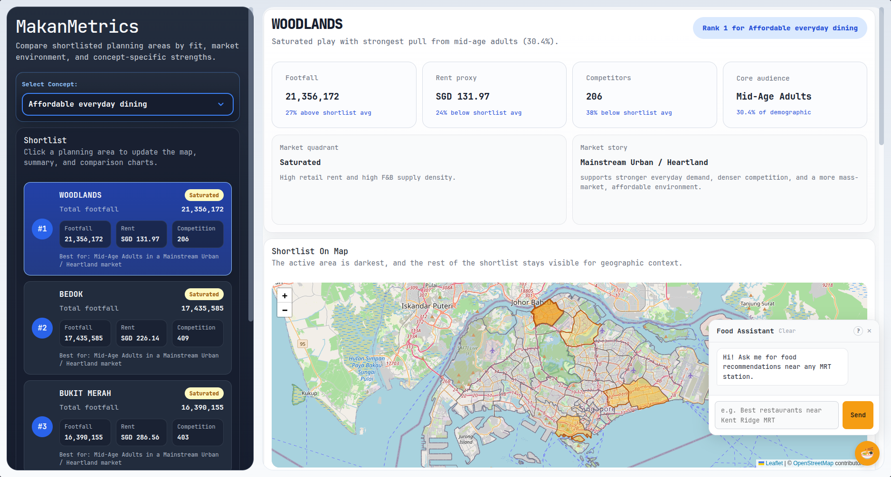

# MakanMetrics



MakanMetrics is an F&B location intelligence platform for Singapore. It combines graph-based restaurant indexing, Pareto-front analysis, KMeans clustering and an AI-powered chatbot to help users explore and evaluate F&B business opportunities by planning area.

## Features

- **Interactive dashboard**: explore Pareto-shortlisted planning areas across five F&B concepts, with cluster context, income mix, footfall, competitor density and rent proxy
- **Restaurant knowledge graph**: Neo4j graph of restaurants indexed by MRT station and food category
- **AI food assistant**: chatbot that answers natural language queries ("best hawker stalls near Tampines", "should I open a cafe near Jurong?") using RAG over the knowledge graph and Pareto analysis
- **Pareto analysis**: data-driven justification of why an area is or is not optimal for a given F&B concept

## Project Structure

```
fnb-analytics/
├── src/                                          # React frontend (Vite)
│   ├── App.jsx                                   # root component
│   ├── Dashboard.jsx                             # main dashboard layout
│   ├── Chatbot.jsx / Chatbot.css                 # AI food assistant widget
│   ├── ...                                       # chart and display components
│
├── data/                                         # Python backend
│   ├── api.py                                    # FastAPI server (POST /ask)
│   ├── askllm.py                                 # RAG pipeline (parse -> Neo4j -> LLM)
│   ├── build_pareto_map_data_updated.py          # regenerates Pareto JSON/CSV outputs
│   ├── get_postal.py                             # enriches raw scraped CSVs with postal codes and coordinates
│   ├── archetypes.json                           # F&B concept definitions (single source of truth)
│   ├── category_map.json                         # food category aliases -> canonical names
│   ├── mrt_to_planning_area.json                 # MRT station -> planning area lookup
│   ├── planning_area_to_mrts.json                # planning area -> MRT stations (reverse)
│   ├── master_dataset.csv                        # planning-area feature dataset (generated by notebook 01)
│   ├── pareto_shortlists_updated.json            # Pareto results consumed by the dashboard
│   └── pareto_shortlists_updated.csv             # flat CSV version of Pareto results
│
├── notebooks/
│   ├── 01_master_dataset_builder.ipynb           # EDA and builds master_dataset.csv from raw sources
│   ├── 02_clustering_and_pareto_processing.ipynb # KMeans clustering and Pareto analysis
│   ├── 03_data_preprocessing.ipynb               # restaurant data cleaning pipeline
│   ├── 04_build_graph_db.ipynb                   # builds Neo4j knowledge graph from cleaned CSV
│   └── 05_performance_profiling.ipynb            # profiling of Pareto and clustering pipeline
│
├── dataset/                                      # raw source data (gitignored, see below)
│   ├── 01_restaurant_scraped/                    # one CSV per MRT station (~130 files, see below)
│   ├── 02_aggregated/                            # auto-created by notebook 03 (aggregated_restaurant.csv)
│   ├── 03_cleaned/                               # auto-created by notebook 03 (cleaned_restaurant.csv)
│   ├── LTA Footfall Traffic Datasets/            # LTA origin-destination train/bus footfall
│   ├── SFA Eating Establishment Dataset/         # SFA licensed eating establishment data
│   ├── REALIS data/                              # retail rental transactions (Q1-Q4 2025)
│   ├── Singstat Demographic and Income Datasets/ # census demographic and income data
│   └── Subzone and Locations Datasets/           # GeoJSON boundaries and MRT station codes
│
├── index.html
├── vite.config.js
├── package.json
└── requirements.txt
```

## Dataset Setup

The `dataset/` folder is gitignored and must be assembled manually before running the notebooks. `data/master_dataset.csv` is generated automatically by notebook 01.

### 1. Restaurant Scraped Data (`dataset/01_restaurant_scraped/`)

One CSV per MRT station, each named after the station (e.g. `tampines.csv`). To produce these files:

1. Scrape restaurant listings using [ReinerJasin/google_maps_detailed_scraping](https://github.com/ReinerJasin/google_maps_detailed_scraping)
2. Run `data/get_postal.py` on the raw CSVs to enrich them with postal codes (via Google Places API) and coordinates (via OneMap API)

Place the enriched files in `dataset/01_restaurant_scraped/`.

**Required columns after enrichment:** `name`, `category`, `rating`, `reviews`, `price`, `address`, `status`, `snippet`, `img`, `url`, `postal`, `lon`, `lat`

> `dataset/02_aggregated/` and `dataset/03_cleaned/` are created automatically when notebook 03 runs. You do not need to create them manually.

### 2. LTA Footfall Traffic Datasets

Origin-destination passenger volume data from the LTA DataMall.

- `transport_node_train_YYYYMM.csv`: train tap-in/tap-out by station
- `transport_node_bus_YYYYMM.csv`: bus boarding/alighting by stop

Download from: [LTA DataMall](https://datamall.lta.gov.sg/content/datamall/en/dynamic-data.html)

Place files in `dataset/LTA Footfall Traffic Datasets/`.

### 3. SFA Eating Establishment Dataset

Licensed eating establishment data from the Singapore Food Agency.

- `EatingEstablishments.geojson`

Download from: [data.gov.sg](https://data.gov.sg)

Place in `dataset/SFA Eating Establishment Dataset/`.

### 4. REALIS Retail Rental Data

Retail rental transaction data from URA REALIS, used as a rent proxy per planning area.

- One CSV per quarter: `REALIS-retail_rental-Q12025.csv` through `Q42025.csv`
- `REALIS-postal_district_key.csv`: maps postal districts to planning areas

Download from: [URA REALIS](https://www.ura.gov.sg/reis/index)

Place files in `dataset/REALIS data/`.

### 5. Singstat Demographic and Income Datasets

2020 Census of Population data from the Singapore Department of Statistics.

- `ResidentPopulationbyPlanningAreaSubzoneofResidenceAgeGroupandSexCensusofPopulation2020.csv`
- `ResidentHouseholdsbyPlanningAreaofResidenceandMonthlyHouseholdIncomefromWorkCensusOfPopulation2020.csv`

Download from: [Singstat](https://www.singstat.gov.sg/find-data/search-by-theme/population/geographic-distribution/latest-data)

Place in `dataset/Singstat Demographic and Income Datasets/`.

### 6. Subzone and Locations Datasets

GeoJSON and reference files for spatial joins and MRT station lookups.

- `SubzoneBoundary.geojson`: planning area and subzone boundaries
- `LTAMRTStationExit.geojson`: MRT station exit locations
- `LTABusStop.geojson`: bus stop locations
- `TrainStationCodes.csv`: MRT station codes and line mappings

Download from: [data.gov.sg](https://data.gov.sg) and [LTA DataMall](https://datamall.lta.gov.sg)

Place in `dataset/Subzone and Locations Datasets/`.

### After assembling the dataset

Run the notebooks in order, **from the project root** (all dataset paths in the notebooks are relative to the project root, not the `notebooks/` folder).

- **01** builds `data/master_dataset.csv`
- **02** produces the Pareto and clustering results
- **03** aggregates `dataset/01_restaurant_scraped/` into `dataset/02_aggregated/aggregated_restaurant.csv`, then cleans it to `dataset/03_cleaned/cleaned_restaurant.csv`
- **04** loads `dataset/03_cleaned/cleaned_restaurant.csv` into Neo4j

## F&B Concepts

Concepts are defined in `data/archetypes.json`. Each specifies which metrics to maximise/minimise in the Pareto analysis.

| Concept | Primary Sort Metric |
|---|---|
| Affordable Everyday Dining | `log_footfall` |
| Premium Cafe / Specialty Cafe | `mean_price_mid` |
| Family-Oriented Casual Dining | `mid_income_ratio` |
| Local Cuisine / Traditional Favorites | `hawker_stall_count_ratio` |
| Fast-Food / Grab-and-Go | `log_footfall` |

## Cluster Archetypes

KMeans (k=3) groups planning areas into market archetypes used to contextualise Pareto results.

| Cluster | Label | Characteristics |
|---|---|---|
| 0 | Mainstream Urban / Heartland | High everyday demand, dense competition, mass-market pricing |
| 1 | Peripheral / Low-Intensity | Sparse commercial ecosystems, low F&B density |
| 2 | Premium Central / Lifestyle | Higher price points, strong ratings, greater category diversity |

## Setup

### Requirements

```bash
pip install -r requirements.txt
npm install
```

### Environment variables

Create a `.env` file in the project root:

```
NEO4J_URI=bolt://<host>:7687
NEO4J_USERNAME=neo4j
NEO4J_PASSWORD=<password>
OPENAI_API_KEY=<key>
GEMINI_API_KEY=<key>
```

### Build the Neo4j graph

Open and run `project/restaurant_index_agent/02_build_graph_db.ipynb`.

### Regenerate Pareto data

If you change `archetypes.json` or the source data:

```bash
cd data
python build_pareto_map_data_updated.py
```

### Run the backend

```bash
cd data
uvicorn api:app --reload
```

### Run the frontend

```bash
npm run dev
```

The app will be available at `http://localhost:5173`.

## AI Food Assistant

The chatbot at the bottom-right of the dashboard answers queries in natural language.

**Example queries:**
- `Best hawker stalls near Tampines`
- `Japanese restaurants near Orchard`
- `Should I open a Malay restaurant near Woodlands?`
- `Top restaurants near Jurong with pareto analysis`

**How it works:**
1. LLM extracts MRT station and food category from the query
2. Neo4j returns matching restaurants sorted by rating
3. Pareto cache looks up the planning area's F&B concept fit
4. LLM generates an intro and Pareto justification, while Python formats the restaurant list

The assistant is scoped to restaurant data and Pareto analysis. It does not give general business advice.
